  

  
  

---

Started in release engineering, moved into building monitoring stacks and CI/CD pipelines, then led company-wide platform migrations -- source control, security scanning, artifact management, the whole dev toolchain. Now I automate Day 0 infrastructure to speed up region rollouts, cut time to market, and reduce cloud spend. Also train and mentor engineers in DevOps practices.

---

#### 🚀 What I build

**[Scout](https://github.com/hriprsd/scout)** -- Codebase indexer for AI coding tools. Hierarchical, content-addressed, zero dependencies. Serves your entire repo structure in ~700 tokens instead of dumping millions.

**[RAGdoll](https://github.com/hriprsd/RAGdoll)** -- Local RAG engine that indexes all your projects into one searchable SQLite store. Hybrid BM25 + vector search, ONNX embeddings, no cloud, no PyTorch.

**[bonk](https://github.com/hriprsd/bonk)** -- Beat your laptop into submission. A small Go utility born out of frustration.

**[trivy-resource](https://github.com/hriprsd/trivy-resource)** -- Concourse CI resource for container vulnerability scanning with Trivy.

**[slack-notification-resource](https://github.com/hriprsd/slack-notification-resource)** -- Concourse CI resource for Slack notifications.

---

#### ✍️ What I write about

- [I Built a Codebase Indexer That Uses 700x Fewer Tokens Than Dumping Your Repo](https://medium.com/@hriprsd/i-built-a-codebase-indexer-that-uses-700x-fewer-tokens-than-dumping-your-repo-9c8314f86a23)
- [Building Scout Part 2: Regex Parsers, Content Addressing, and Zero Dependencies](https://medium.com/@hriprsd/building-scout-part-2-regex-parsers-content-addressing-and-zero-dependencies-cc976eaac339)
- [I Built a Local RAG Engine Because My AI Tools Keep Forgetting Everything](https://medium.com/@hriprsd/i-built-a-local-rag-engine-because-my-ai-tools-keep-forgetting-everything-6f6a550817d5)
- [Building RAGdoll Part 2: ONNX, Hybrid Search, and Why I Skipped PyTorch](https://medium.com/@hriprsd/building-ragdoll-part-2-onnx-hybrid-search-and-why-i-skipped-pytorch-f33e967f0912)

#### 📎 Gists

Infra snippets, automation scripts, and field notes: [gist.github.com/hriprsd](https://gist.github.com/hriprsd)

---

#### 🧰 Toolbox

  

  

  
  
  
  
  
  

#### 🔐 Security & Compliance

  
  
  
  
  

---

  Arctic Code Vault Contributor
    
  <i>Mechanical engineering grad who wandered into servers and never came back.</i>

